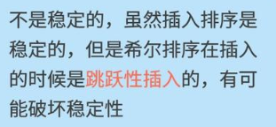
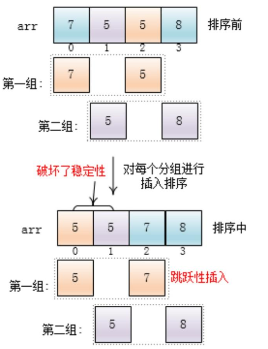

# 希尔排序

## 介绍：


希尔排序是希尔（Donald Shell）于1959年提出的一种排序算法。希尔排序也是一种插入排序，它是简单插入排序经过改进之后的一个更高效的版本，也称为缩小增量排序，同时该算法是冲破O(n2）的第一批算法之一。

## 实现思路：

- 选择一个增量序列 t1，t2，……，tk，其中 ti > tj, tk = 1；

- 按增量序列个数 k，对序列进行 k 趟排序；

- 每趟排序，根据对应的增量 ti，将待排序列分割成若干长度为 m 的子序列，分别对各子表进行直接插入排序。仅增量因子为 1 时，整个序列作为一个表来处理，表长度即为整个序列的长度。

**就是在插入排序外层多了两层循环并且将原来是1的替换成gap**
**将扑克牌分组**


## 代码实现：


```js
 function shellSort ( arr ) {
	if ( !arr || arr.length === 0 ) {
		return;
	}
	var len = arr.length;
	for ( var gap = 3; gap > 0; gap-- ) {
		for ( var i = 0; i < gap; i++ ) {
			for ( j = i + gap; j < len; j += gap ) {
				var temp = arr[ j ];
				var k = j - gap;
				while ( j >= 0 && temp < arr[ k ] ) {
					arr[ k + gap ] = arr[ k ];
					k -= gap;
				}
				arr[ k + gap ] = temp;
			}
		}
	}
	return arr;
}
var arr = [ 23, 12, 324, 45, 562, 4, 11, 43, 54, 12, 2, 1, 0, 10 ];
console.log( shellSort( arr ) );


```

## 复杂度：

时间复杂度：希尔排序的复杂度和增量序列是相关的  (不用分析，太复杂了) 

空间复杂度:O(1)       

## 稳定性

不稳定


